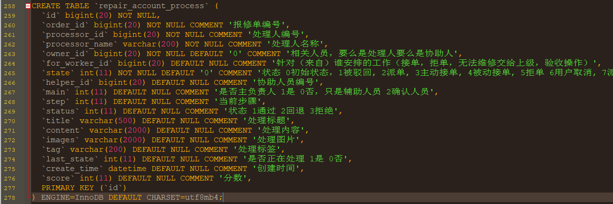
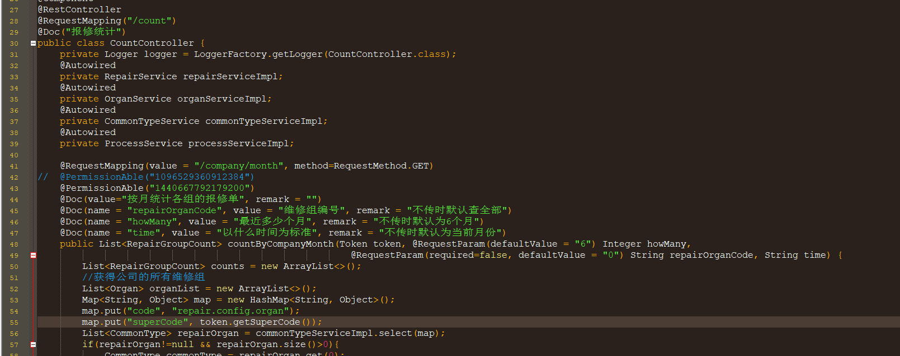
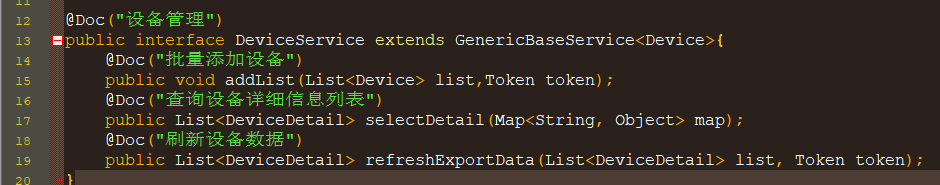
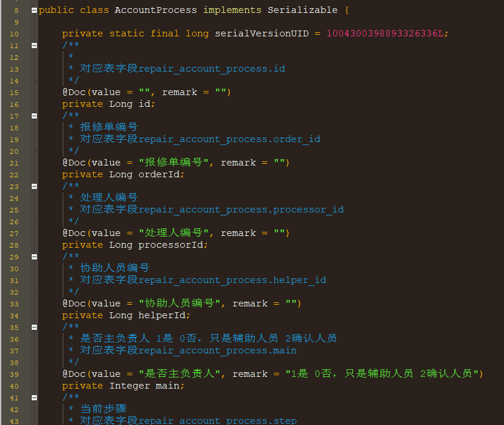
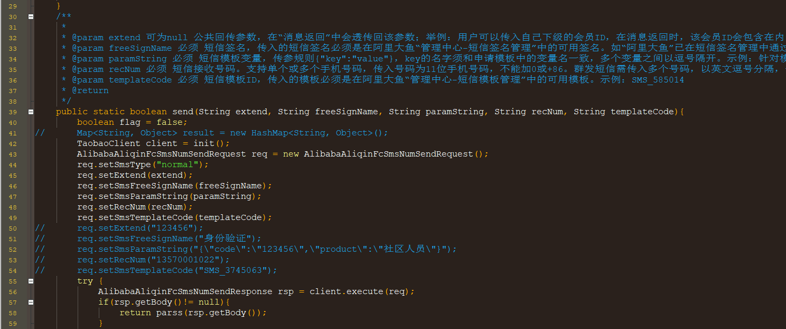
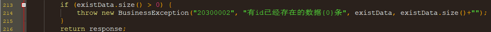
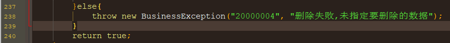
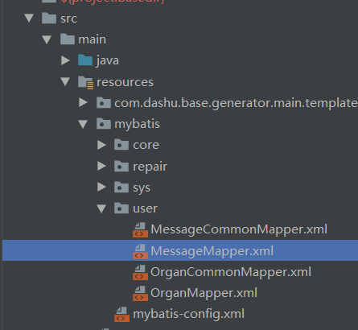
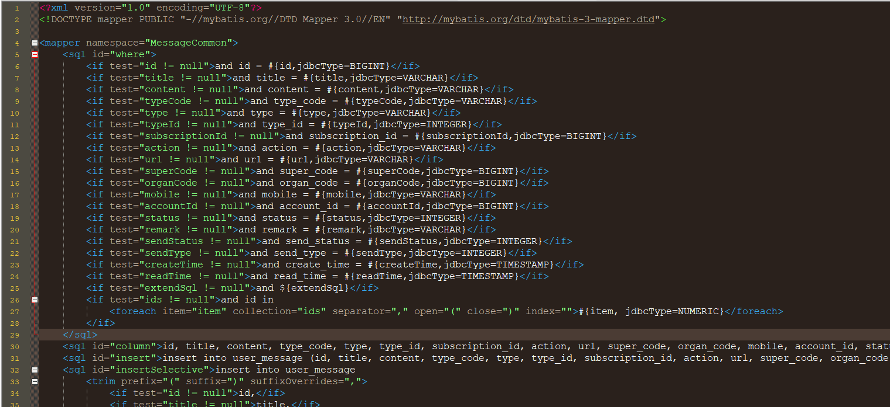
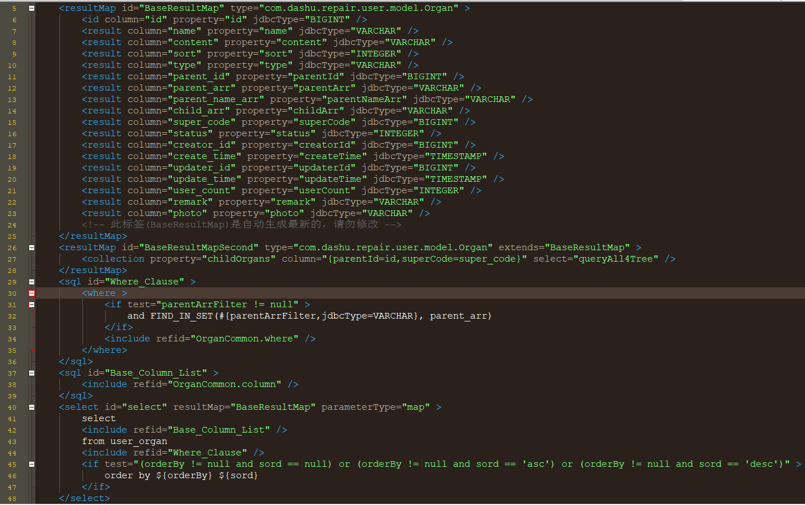

# 数据库设计规范

### 表名规范

例如：**repair_account_process**

- 表名、字段名全小写，用下划线隔开。
- 表名第一个为模块（组）名称，后面的才是表的具体名称
- repair为模块名称，account_process为具体表名，对应的实体名为AccountProcess
- 根据表名规范，对应的请求路径格式为：/系统名称/模块名/具体表名

例如：
> http://127.0.0.1/systemName/repair/accountProcess

> http://127.0.0.1/systemName/repair/accountProcess/1234455666




- 每张表必须含有一个主键（关联表除外），统一为id，long类型，为了分布式，到时通过雪花算法生成
- 如果业务处理中涉及到逻辑删除的，字段名统一定义为is_delete，0未删除，1已删除
- 每个字段须写清楚含义，第一个空格前的为字段中文名称，后面的全部为备注说明

**其他说明**：


- 对于数据库中的触发器，命名前缀为trigger_***
如：trigger_repair_process
- 对于数据库中的视图，命名前缀为view_***
如：view_account

### 注释规范


- 项目开发中，主要有4个地方是要写清楚注释的
   1. **controller类**
      - 类上面要写清楚该类的功能类别。
      - 对外返回数据的方法（即面向前端的接口）则要写清楚该方法的功能，必要时还要加备注。
      - 方法的参数也要写清楚注释，主要是基本类型的参数，实体类型的参数则由框架生成处理。
      - 参数的传入方式统一用spring的参数绑定模式，不要采用从request请求中获取这种方式。
      - 对于需要用户登录的接口，统一注入用户基本信息（方便后面扩展记录用户行为操作）。
      - 方法的返回类型必须清楚定义，不要返回map，object……这些不明结构的数据
      - 写法参考如下：



   2. **接口类（service服务接口、dubbo服务接口）**
      - 写法参考如下：




   3. **实体类**
      - 各成员属性写清楚注释，每个set方法都返回自身对象。
      - 写法参考如下：




   4. **提供给他人使用的封装类（主要为工具类）**
      - 方法及参数说明要写清楚




### 异常定义规范

- **异常定义为7位数**
----

| 0  | 00 | 0000|
|:-- |:-- |:-- |
| 第一位表示异常类型 | 第2、3位数字代表系统编号 | 具体业务编号 |
| 1代表系统异常<br/>即一些公用组件抛出的异常<br/> | 比如：<br/>01代表支付系统<br>02代表认证系统 | 开发人员自己定义，配置完成后记录到配置文件或配置中心<br/> |
| 2代表业务异常<br/>主要是业务系统抛出的异常  |  |   |

- 特殊编码：1 00 0000 表示系统未知异常，即开发里没有封装到的
- 注意考虑，当接口返回NULL时，是否特殊处理
- 参考如下：





这样抛出异常后，给框架封装返回的数据。因为开发中返回的信息不一定符合上线后面向用户的信息，到时配合配置中心使用，如果配置中心有相应异常编码的信息配置，将会替换代码中的提示。

另外，需要向用户返回的提示信息也应设计成编号与消息内容对应的方式。

### 统一数据格式返回


- 对外接口的数据返回格式统一，由框架包装

```json
{
    status: "int调用接口是否成功，0：失败，1：成功",
    errorCode: "string错误码，当status=0时，必须返回错误码",
    message: "string错误具体信息",
    data: {
       //具体内容
    }
}
```

- 方法的返回类型必须清楚定义，不要返回map，object……这些不明结构的数据

- 是否需要参考httpstatus封装


 


### 基于规范后的功能扩展


- 根据以上各项规范，提供自动生成代码模块功能，即普通的增删改查功能




- 自动生成的mapper文件，不能修改，重新生成时会覆盖




- 可扩展的mapper文件。除了返回数据的映射不能修改，其于的都可扩展修改

