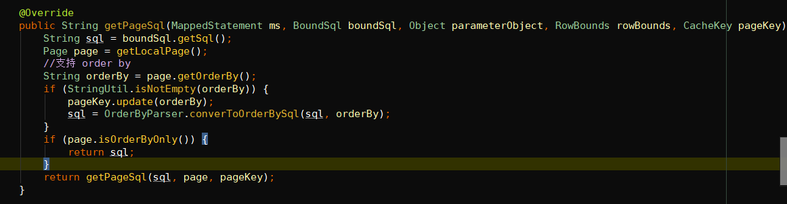
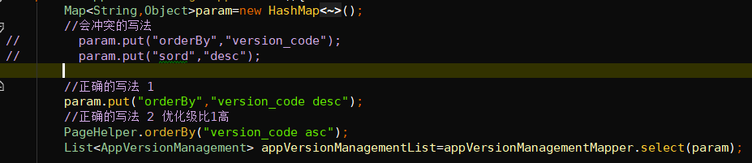

# 数据库查询方法selectOne();
此方法设计时考虑针对的是联合主键。如果传入的查询条件查出多条数据，系统将抛出异常。

如果业务上确认查询只需要一条数据（当查出多条符合条件的数据时），可以修改相应的***Mapper.xml文件，增加limit关键字，如下
```xml
<select id="selectOneBase" resultMap="BaseResultMap" parameterType="map" >
    select
    <include refid="Base_Column_List" />
    from sec_api_permission
    <include refid="Where_Clause" />
	limit 0,1
</select>
```


# 批量操作数据
批量插入数据在service层，mapper层暂不支持，稍后评估是否增加，

例如根据id删除多条数据
```java
Long[] ids = new Long[] {1131313l,313131313l};
map.put("ids", ids);
mapper.delete(map);
```


# 分页查询
```java
public PageList<Org> getTreeList(Long orgId, String orgName, PageParameter page) {
   PageHelper.startPage(page.getPage(), page.getRows());
   List<Org> orgList = orgMapper.selectList(New.hashMap("orgId", orgId,"orgName",orgName));
   return new PageList<Org>(new PageInfo<Org>(orgList));
}
```


# 扩展查询条件
```
//第一种，利用已存在的扩展字段extendSql
map.put("extendSql", "(step = 0 or step = 1)");


//第二种，修改相应的***Mapper.xml
<sql id="Where_Clause" >
    <where >
        <if test="sTime != null and eTime != null" >
            and submit_time BETWEEN #{sTime,jdbcType=VARCHAR} AND #{eTime,jdbcType=VARCHAR}
        </if>
        <include refid="OrderCommon.where" />
    </where>
</sql>
```


# 排序

PageHelper.orderBy("id desc");//orderBy值为表字段名加asc、desc，非实体类属性

框架里的排序字段（orderBy, sord）与pageHelper分页插件冲突,pagehelper中检测到有orderBy参数时，会覆盖原来生成的SQL语句

参考写法如下：

后续会移除生成的mapper.xml里的排序信息，以兼容分页插件

